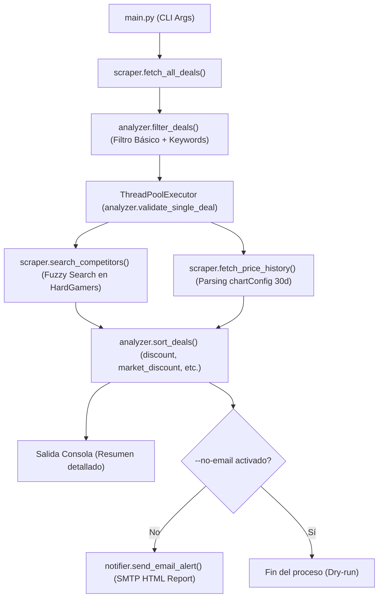

# HardGamers Deals Scraper & Market Validator Agent (`AGENT.md`)

Este documento sirve como guía técnica y de arquitectura para agentes de inteligencia artificial y desarrolladores que operen, mantengan o extiendan este proyecto.

---

## 1. Misión y Propósito del Agente

El objetivo principal de este agente es **monitorear, auditar y reportar ofertas de hardware en Argentina** obtenidas desde la plataforma [HardGamers](https://www.hardgamers.com.ar).

A diferencia de un scraper tradicional que solo extrae datos de la sección de descuentos, este agente:
1. **Scrapea** las páginas de ofertas (`/deals`).
2. **Filtra** por umbrales de descuento, caída de precio y palabras clave.
3. **Valida contra la competencia**: Busca el mismo producto en otras tiendas en HardGamers mediante búsqueda difusa y comprueba si realmente es el precio más bajo del mercado.
4. **Audita el historial de precios (30 días)**: Extrae el histórico embebido (`chartConfig`) en la ficha del producto para comprobar si hubo una suba artificial previa de precio (descuentos falsos) y calcular el ahorro real frente al promedio de 30 días.
5. **Notifica**: Genera un reporte HTML responsivo y lo envía automáticamente por correo vía SMTP (o lo muestra en consola en modo dry-run).

---

## 2. Estructura y Arquitectura del Código

```text
hardgamers-ia/
├── main.py                   # Orquestador del flujo CLI (entrypoint)
├── scraper.py                # Peticiones HTTP, parsing HTML, regex y scraping de historial
├── analyzer.py               # Lógica de filtrado, multithreading, matching de mercado y ordenamiento
├── notifier.py               # Generación de plantilla HTML y envío SMTP
├── config.py                 # Variables de entorno y configuraciones globales
├── test_product_history.py   # Script de testing para inspección de scripts/DOM
├── test_rate_limit.py        # Script de testing para rate limits (429) y umbrales
├── pyproject.toml            # Definición de dependencias y Python >=3.14 con uv
└── uv.lock                   # Lockfile de dependencias
```

### Modelos de Datos (`scraper.py`)

- **`Deal`**: Representa una oferta individual:
  - `title`, `store`, `current_price`, `previous_price`, `discount_percent`, `product_link`, `image_url`
  - *Validación de mercado*: `similar_found`, `competitors` (lista de tiendas/precios), `min_competitor_price`, `market_discount_percent`, `is_truly_cheaper`
  - *Historial de precios*: `history` (instancia de `PriceHistory`)

- **`PriceHistory`**: Métricas calculadas del historial de 30 días:
  - `days_count`: Cantidad de días registrados.
  - `avg_price`, `min_price`, `max_price`: Estadísticas previas a la oferta.
  - `historical_discount_percent`: Descuento respecto al promedio de los últimos 30 días.
  - `has_recent_price_increase`: Flag booleano (`True` si el precio subió >5% en los 5 días previos a la oferta).
  - `raw_history`: Puntos de fecha y precio extraídos.

---

## 3. Pipeline de Ejecución



---

## 4. Estrategias y Algoritmos Clave

### A. Control de Rate Limiting (HTTP 429)
HardGamers aplica limitación de tasa ante ráfagas de consultas a `/search` y fichas de productos. El agente implementa:
1. **Sesión HTTP Reutilizable con `urllib3.util.Retry`**: Reintentos automáticos con backoff exponencial para códigos 429, 500, 502, 503, 504 (`scraper.create_session()`).
2. **Priorización antes de validar (`max_deals_to_validate`)**: Solo se valida a fondo el top N de candidatos (por defecto 15) que hayan pasado el primer filtro de descuento.
3. **Pausas (`sleep`) y concurrencia controlada**: `ThreadPoolExecutor` con máximo 3 workers y pausas breves para no saturar la API.

### B. Búsqueda y Comparación de Competidores (`search_competitors`)
- Extrae tokens alfanuméricos relevantes del título del producto (máximo 5 tokens principales).
- Consulta `/search?text=...`.
- Compara los resultados ignorando la misma tienda de la oferta.
- Aplica doble validación de similitud:
  - **Token Ratio**: Coincidencia de tokens compartidos $\ge 50\%$.
  - **SequenceMatcher Ratio**: Similitud de texto $\ge 60\%$.
- Identifica el precio mínimo entre competidores y calcula el `market_discount_percent`.

### C. Detección de Descuentos Falsos (`fetch_price_history`)
- Descarga la página del producto y extrae la variable JavaScript `var chartConfig = {...};` mediante expresiones regulares y `json.loads`.
- Extrae el arreglo de precios excluyendo el último valor (precio de hoy).
- Si el precio promedio de los últimos 5 días fue $>5\%$ mayor que el promedio anterior, marca `has_recent_price_increase = True` (alerta de subida artificial previa).

---

## 5. Parámetros de Configuración y Variables de Entorno

Definidas en `config.py` con lectura mediante `os.environ`:

| Variable | Descripción | Valor por Defecto |
|---|---|---|
| `SMTP_SERVER` | Servidor SMTP para envío de correos | `smtp.gmail.com` |
| `SMTP_PORT` | Puerto SMTP (con soporte TLS) | `587` |
| `SMTP_USER` | Usuario / Correo de autenticación SMTP | `""` |
| `SMTP_PASSWORD` | Contraseña o App Password de SMTP | `""` |
| `EMAIL_FROM` | Remitente del correo | Valor de `SMTP_USER` |
| `EMAIL_TO` | Destinatarios (separados por coma) | `""` |
| `MIN_DISCOUNT_PERCENT` | Descuento mínimo en tienda (%) | `20` |
| `MIN_PRICE_DROP_ARS` | Caída mínima de precio absoluto (ARS) | `500` |
| `INCLUDE_KEYWORDS` | Filtro de inclusión global (coma-separado) | `""` |
| `EXCLUDE_KEYWORDS` | Filtro de exclusión global (coma-separado) | `"switch"` |

---

## 6. Interfaz CLI (`main.py`)

| Argumento | Tipo | Default | Descripción |
|---|---|---|---|
| `--max-pages` | `int` | `1` | Cantidad de páginas de `/deals` a scrapear |
| `--min-discount` | `int` | `30` | Descuento mínimo en tienda (%) para ser candidato |
| `--min-price-drop` | `float` | `None` | Caída mínima en pesos (ARS) |
| `--include` | `str` | `None` | Palabras clave obligatorias (ej. `"monitor,lg"`) |
| `--exclude` | `str` | `None` | Palabras clave a excluir (ej. `"teclado,switch"`) |
| `--max-deals-to-validate` | `int` | `15` | Límite de ofertas a validar contra competidores/historial |
| `--sort-by` | `str` | `discount` | Criterio de orden: `discount`, `market_discount`, `price_drop`, `price_asc` |
| `--no-validate-market` | `flag` | `False` | Deshabilita la validación contra otras tiendas e historial |
| `--no-email` | `flag` | `False` | Modo Dry-run: muestra en consola sin enviar email |
| `--limit-output` | `int` | `10` | Cantidad de ofertas a listar en la consola |

### Ejemplos Comunes de Ejecución

```bash
# Modo prueba sin enviar emails
uv run main.py --no-email

# Filtrar monitores con validación de mercado ordenados por ahorro real
uv run main.py --include "monitor" --sort-by market_discount --no-email

# Ejecución de producción recomendada (Top 15 ofertas verificadas)
uv run main.py --max-pages 2 --min-discount 25 --max-deals-to-validate 15 --sort-by market_discount
```

---

## 7. Instrucciones para Agentes de IA

Al trabajar en este repositorio, sigue las siguientes reglas:

1. **Gestor de paquetes `uv`**: Utiliza siempre `uv run <comando>` o `uv sync`. No invoques `pip` directamente a menos que sea necesario.
2. **Respeto a Rate Limits**: No aumentes masivamente el número de hilos concurrentes en `analyzer.py` ni elimines el límite `max_deals_to_validate` sin añadir mecanismos de throttling/cache, ya que HardGamers bloqueará las peticiones con código `429 Too Many Requests`.
3. **Robustez en Parsing de HTML/JS**: Los elementos HTML de HardGamers (`One-Bit-Product`, `p.product-price`, `chartConfig`) pueden cambiar su estructura. Mantén siempre bloques `try/except` defensivos y fallbacks.
4. **Manejo de Moneda y Formato**: En Argentina los precios usan punto como separador de miles y coma como separador de decimales (`$257.596` o `$1.234,50`). Usa siempre `parse_price()` en `scraper.py`.
